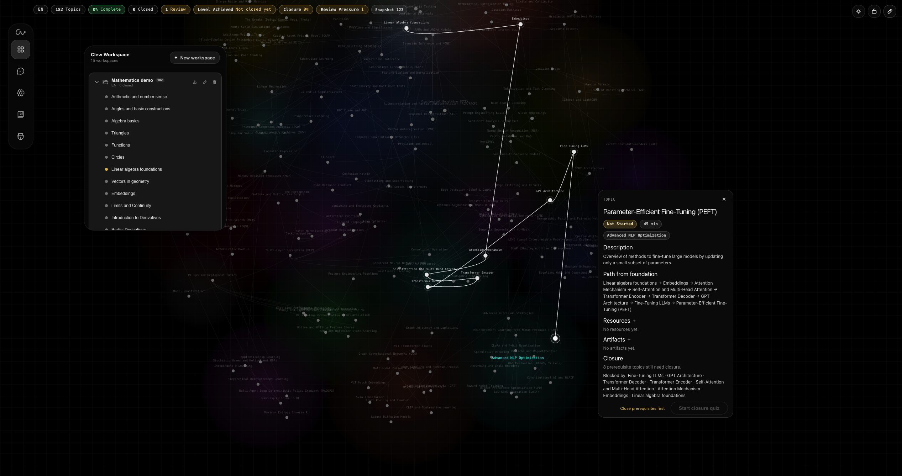
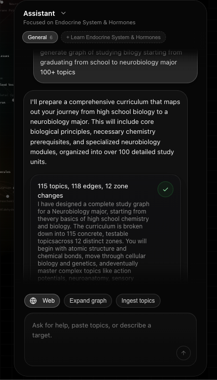
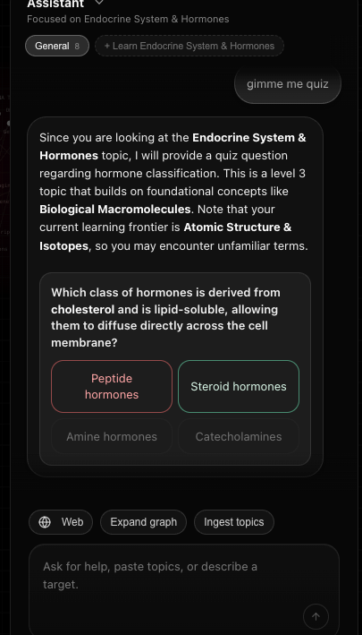
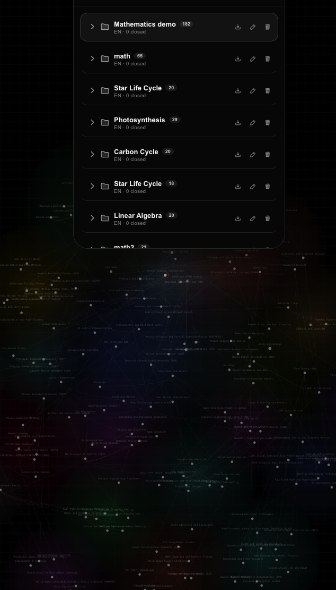

# Clew

<p>
  <a href="LICENSE"></a>
  <a href="https://github.com/miuuyy/Clew/actions/workflows/ci.yml"></a>
  
  
  
  
</p>

**Generate a learning map. Click any topic. Follow the thread.**


Clew is a local, AI-assisted workspace for studying through dependency graphs. Start from a goal, a rough topic dump, or an Obsidian vault; Clew turns it into a map of topics, prerequisites, resources, artifacts, and progress.

The graph is the workspace. AI can draft, expand, audit, and reshape it, but changes stay visible, reviewable, and reversible.

Try the hosted version at [clew.my](https://clew.my), or run this repo locally when you want provider control, local state, Obsidian import/export, and MCP context.

## Quick Look

- `Core idea`: a visible thread through hard subjects
- `Main move`: click a topic and see the path that leads to it
- `Graph generation`: build a map from a goal, notes, topic list, or Obsidian vault
- `AI boundary`: AI proposes structure; you review and apply changes
- `Local edition`: SQLite, provider keys, Gemini/OpenAI support, import/export, MCP

## Quick Start

```bash
git clone https://github.com/miuuyy/Clew.git
cd Clew
cp .env.example .env
./scripts/dev.sh
```

Set one provider key in `.env`:

```bash
KG_GEMINI_API_KEY=...
# or
KG_OPENAI_API_KEY=...
```

Then open:

- frontend: `http://127.0.0.1:5178`
- backend: `http://127.0.0.1:8787`

## Why Clew Exists

Learning a big subject is not just about collecting resources. The hard part is structure.

A chat answer can tell you what to read. Tools like [roadmap.sh](https://roadmap.sh) show a common route. But when your goal is specific, you need to see what actually unlocks what: which foundations matter now, which topics can wait, where you are blocked, and how far you are from the thing you want to build.

Clew makes that structure visible.

Instead of manually arranging a huge roadmap, you let AI draft the graph. Then you study through it: click topics, inspect prerequisite paths, attach resources, pass quizzes, mark progress, and keep the whole learning process tied to the map.

## Features

- `Click-to-path navigation`: select any topic and reveal the prerequisite chain behind it.
- `Generative roadmaps`: create a dependency graph from a goal, topic dump, notes, or vault.
- `Graph-first workspace`: topics, dependencies, zones, resources, artifacts, layout, and progress live on one surface.
- `Reviewable AI changes`: ingest, expand, audit, reshape, apply, and roll back through snapshots.
- `Study loop`: topic sessions, assistant help, inline quizzes, closure quizzes, and manual completion when strict gating is disabled.
- `Obsidian bridge`: import a vault into Clew or export a graph back into an Obsidian-ready folder.
- `Obsidian-to-Clew import skill`: packaged for Claude Code and Codex to audit a vault, flag blockers, and shape it into a valid Clew package.
- `MCP context bridge`: let Claude, Cursor, or another MCP client read your Clew graphs and progress without copy-paste.
- `Local control`: SQLite workspace, provider keys, Gemini/OpenAI support, OpenAI-compatible endpoint option, memory/persona/thinking settings.

## Example Use Cases

- Turn "I want to build a machine learning project" into the math, programming, and ML path that actually matters.
- Click a hard topic and see the foundations you are missing.
- Build a Python, cybersecurity, systems, math, or exam roadmap with visible prerequisites.
- Convert a messy topic dump into a graph you can actually study through.
- Import an Obsidian vault and check whether your notes form a usable learning structure.
- Ask an external assistant about your current learning path through MCP.
- Export a finished path back to Obsidian as readable notes.

## Visuals



<table>
  <tr>
    <td width="33%">
      
    </td>
    <td width="33%">
      
    </td>
    <td width="33%">
      
    </td>
  </tr>
</table>

## Docs

- [Hosted docs](https://clew.my/how-to-use)
- [Quick start](docs/site_faq/quick-start.md)
- [Features](docs/site_faq/features.md)
- [How to use](docs/site_faq/how-to-use.md)
- [Why special](docs/site_faq/why-special.md)
- [Obsidian and MCP integrations](docs/site_faq/integrations.md)
- [Latest release](https://github.com/miuuyy/Clew/releases/latest)
- [Connect to Claude Desktop / Claude Code / Cursor through MCP](docs/MCP_SETUP.md)
- [Obsidian-to-Clew import skill](.claude/skills/obsidian-to-clew-import/SKILL.md)
- [Architecture](docs/ARCHITECTURE.md)
- [Engineering docs index](docs/README.md)

## Repository Map

| Path | Role |
| --- | --- |
| `frontend/` | React workspace UI, graph canvas, themes, settings, dialogs, debug surfaces |
| `backend/` | FastAPI app, repository, domain model, provider layer, planner, MCP server, tests |
| `contracts/` | JSON contracts and transport surfaces used by graph mutation flows |
| `docs/` | Engineering docs, ADRs, release notes, and site FAQ source |
| `scripts/` | Local development helpers such as boot, stop, and reset |
| `.claude/skills/obsidian-to-clew-import/` | Claude Code skill for shaping an Obsidian vault into a Clew import package |
| `.agents/skills/obsidian-to-clew-import/` | Codex-compatible copy of the Obsidian-to-Clew import skill |

## Development Checks

```bash
cd frontend && npm run typecheck && npm run build
PYTHONPATH=backend ./.venv/bin/python -m unittest discover -s backend/tests -v
```

Useful helpers:

```bash
./scripts/dev.sh
./scripts/stop_dev.sh
./scripts/reset_db.sh
```

## Open Source

- [Contributing guide](CONTRIBUTING.md)
- [Code of conduct](CODE_OF_CONDUCT.md)
- [MIT License](LICENSE)

## Contact

- Email: [johnymaarrete@gmail.com](mailto:johnymaarrete@gmail.com)
- LinkedIn: [aleksandr-vechenkov-037b00377](https://www.linkedin.com/in/aleksandr-vechenkov-037b00377/)
