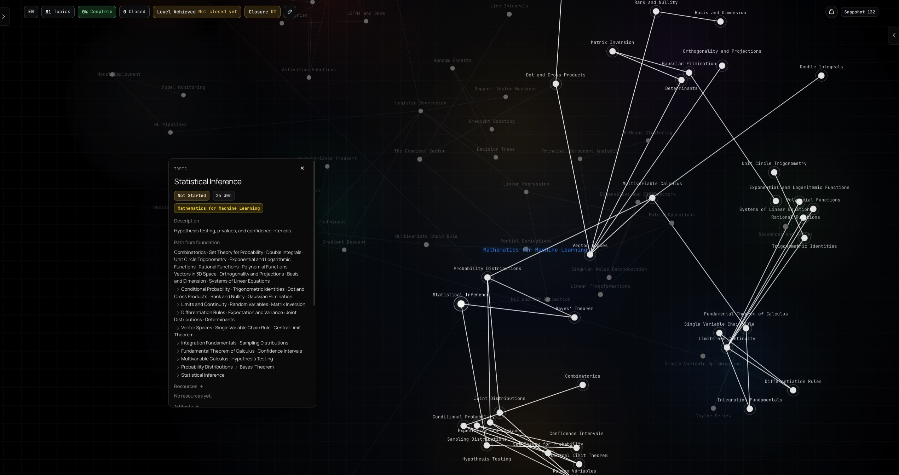
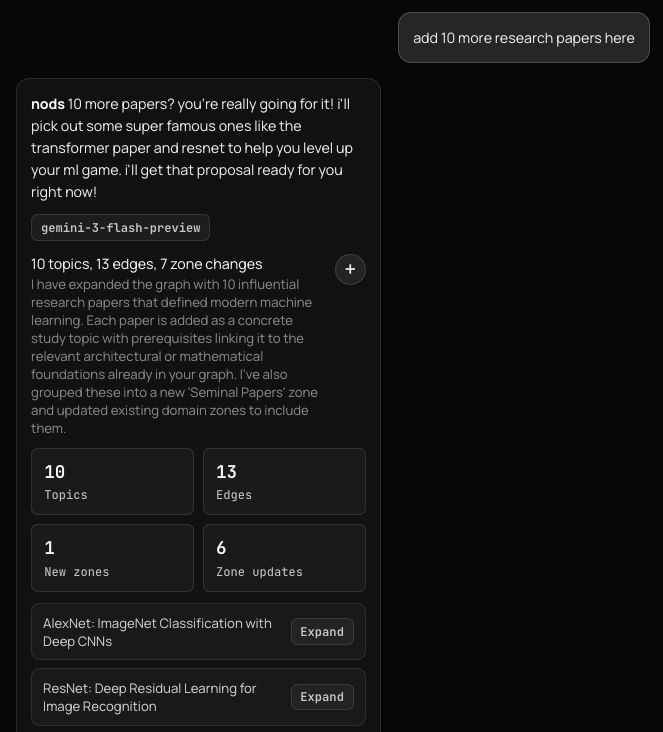
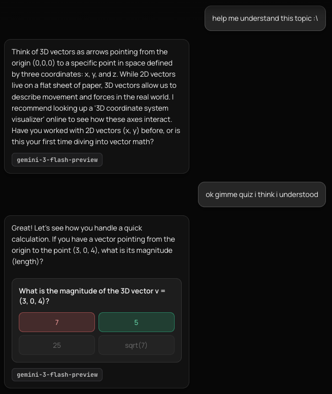

# Clew

<p>
  <a href="LICENSE"></a>
  <a href="https://github.com/miuuyy/mapmind-agentic-workspace/actions/workflows/ci.yml"></a>
  <a href="https://clew.my/how-to-use"></a>
  <a href="https://clew.my"></a>
  
  
  
  
  
</p>

**Clew gives you a thread through anything you're learning.**

It is the thing I wanted when I was trying to understand which parts of a huge school/math/programming curriculum actually mattered for machine learning. Not another note app. Not another chat tab. A clear, visual path through a subject, shaped around your goal.

The quick builder benchmark is: **roadmap.sh, but personalized and adaptive**.

You can ask AI to turn a messy topic dump, an Obsidian vault, or a goal like "get me ready for transformers" into a real dependency graph. Good models can add serious breadth in one pass. You still review what changes before it lands, because the graph is your workspace, not a place where AI silently rewrites the map.


This repository is the local, hackable edition of Clew. If you want the fastest first look, start at [clew.my](https://clew.my). If you want provider control, local state, MCP, and graph import/export, run this repo.

> The repo is still named `mapmind-agentic-workspace` for URL stability; the product is Clew.

## Quick Look

- `The product idea`: a clear path to anything you want to learn
- `The builder shorthand`: roadmap.sh, but personalized and adaptive
- `The AI role`: generate, expand, audit, and reshape the learning graph
- `The trust boundary`: AI proposes; you review; snapshots let you roll back
- `The local edition`: SQLite, your provider keys, Obsidian import/export, MCP server

## Quick Start

```bash
git clone https://github.com/miuuyy/mapmind-agentic-workspace.git
cd mapmind-agentic-workspace
cp .env.example .env
./scripts/dev.sh
```

Set one provider key in `.env`:

- `KG_GEMINI_API_KEY=...`
- `KG_OPENAI_API_KEY=...`

Then open:

- frontend: `http://127.0.0.1:5178`
- backend: `http://127.0.0.1:8787`

## Why It Exists

Learning a big field is mostly a structure problem.

If you want machine learning, you do not need every math topic equally. You need to see which ideas unlock the path, which ones can wait, where the foundations are, and what the next useful edge is. A static public roadmap helps, but it cannot know your current graph, your goal, your notes, or the branch you are actually taking.

Clew uses AI because building that graph manually is too expensive. The model does the heavy structural drafting. The product keeps the draft visible, editable, reviewable, and reversible.

## Features

- `Personal adaptive roadmaps`: generate a learning graph from a goal, a messy topic list, or existing notes.
- `Graph-first workspace`: topics, dependencies, zones, resources, artifacts, manual layout, and progress live on the same surface.
- `AI proposals instead of silent edits`: ingest, expand, audit, review, apply, and roll back through snapshots.
- `Obsidian bridge`: import a vault into a graph, or export a graph back into an Obsidian-ready folder.
- `MCP context bridge`: let an external assistant read your Clew graphs and progress without copy-paste.
- `Study loop`: topic sessions, assistant help, inline quizzes, closure quizzes, and manual completion when strict gating is disabled.
- `Local control`: SQLite workspace, provider keys, Gemini/OpenAI support, OpenAI-compatible endpoint option, memory/persona/thinking settings.

## Example Use Cases

- Turn a giant math syllabus into the parts that matter for ML.
- Build a Python or cybersecurity path with visible prerequisites instead of a vague checklist.
- Import an Obsidian vault and see whether your notes actually form a usable learning structure.
- Ask Claude/Cursor about your current learning path through MCP without pasting graph state.
- Export a finished path back to Obsidian as a readable vault.

## Visuals



<table>
  <tr>
    <td width="50%">
      
    </td>
    <td width="50%">
      
    </td>
  </tr>
</table>

## Docs

- [Hosted docs](https://clew.my/how-to-use)
- [Quick start](docs/site_faq/quick-start.md)
- [Features](docs/site_faq/features.md)
- [How to use](docs/site_faq/how-to-use.md)
- [Why special](docs/site_faq/why-special.md)
- [Obsidian and MCP integrations](docs/site_faq/integrations.md)
- [Latest release notes](docs/RELEASE_0_2_0.md)
- [Connect to Claude Desktop / Claude Code / Cursor (MCP)](docs/MCP_SETUP.md)
- [Architecture](docs/ARCHITECTURE.md)
- [Engineering docs index](docs/README.md)

## Repository Map

| Path | Role |
| --- | --- |
| `frontend/` | React workspace UI, graph canvas, themes, settings, dialogs, debug surfaces |
| `backend/` | FastAPI app, repository, domain model, provider layer, planner, MCP server, tests |
| `contracts/` | JSON contracts and transport surfaces used by graph mutation flows |
| `docs/` | engineering docs, ADRs, release notes, and site FAQ source |
| `scripts/` | local development helpers such as boot, stop, and reset |
| `.claude/skills/`, `.agents/skills/` | project-specific agent skills: `mapmind-product-guard`, `mapmind-agent-boundaries`, `obsidian-to-clew-import` |

## Development Checks

```bash
cd frontend && npm run typecheck && npm run build
PYTHONPATH=backend ./.venv/bin/python -m unittest discover -s backend/tests -v
```

Useful helpers:

```bash
./scripts/dev.sh
./scripts/stop_dev.sh
./scripts/reset_db.sh
```

## Open Source Surfaces

- [Contributing guide](CONTRIBUTING.md)
- [Code of conduct](CODE_OF_CONDUCT.md)
- [MIT License](LICENSE)

## Contact

- Email: [johnymaarrete@gmail.com](mailto:johnymaarrete@gmail.com)
- LinkedIn: [aleksandr-vechenkov-037b00377](https://www.linkedin.com/in/aleksandr-vechenkov-037b00377/)
- Security-sensitive bugs: email privately instead of opening a public issue.
