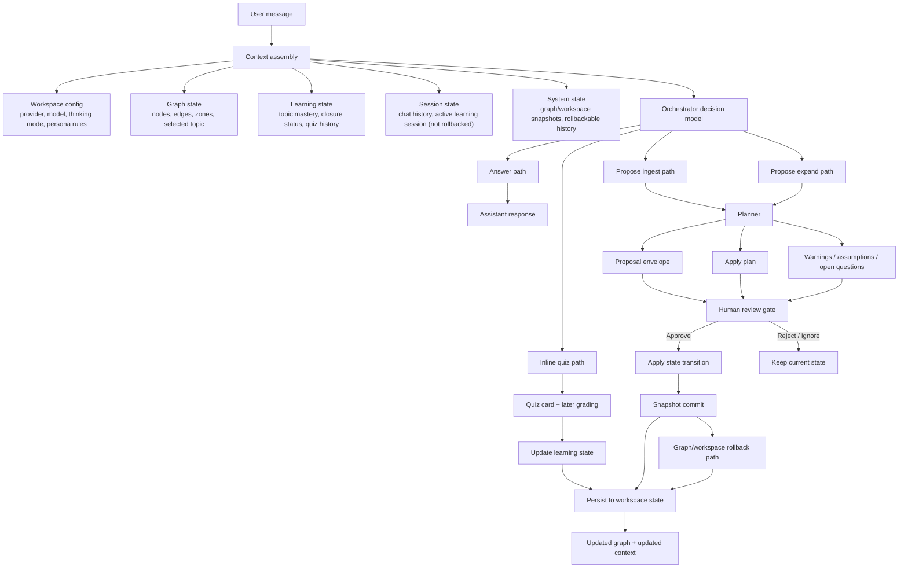

# Agentic Loop

MapMind is not a generic autonomous agent. It is a **stateful learning workspace with an explicit decision-and-review loop**.

The point of this file is to show where the agentic behavior actually lives:

- context is assembled from workspace state
- the model chooses an action shape
- graph mutation stays proposal-based
- accepted changes become rollbackable history

## At a glance

## Why this qualifies as agentic

The product is more than “user sends prompt, model returns text”.

It has:

- persistent world state
- dynamic context assembly
- multiple action paths
- typed outputs
- review before graph mutation
- rollback after accepted changes

That is enough to describe MapMind honestly as an **agentic learning loop** without pretending it is a broad autonomous agent platform.

## The five most important invariants

1. The graph stays the center of truth.
2. The model can propose mutation, not silently perform it.
3. Accepted graph changes stay recoverable through snapshots.
4. Runtime chat state and snapshot state are related but not identical.
5. Completion is attached to topics and closure logic, not only to chat.

## Action shapes

At the orchestrator level the agent can choose among a small set of action families:

- answer in context
- emit an inline quiz
- propose a graph ingest
- propose a graph expansion

That narrow action space is intentional. It keeps the model inside a legible product surface.

## Where the loop lives in code

| Area | Responsibility |
| --- | --- |
| `backend/app/services/chat_orchestrator.py` | builds context and chooses action shape |
| `backend/app/services/gemini_planner.py` | generates proposal drafts and applies validation bridges |
| `backend/app/services/repository.py` | persists workspace, graph, snapshots, and config |
| `backend/app/llm/contracts.py` | action-level contract layer |
| `backend/app/llm/schemas.py` | structured generation schemas and planner draft shapes |

## What this loop is not trying to do

It is not trying to become:

- a background worker swarm
- a hidden supervisor mesh
- a fake autonomous curriculum oracle

The loop exists to make one thing work well: **help a learner build and evolve a structured graph without losing control of the workspace**.
